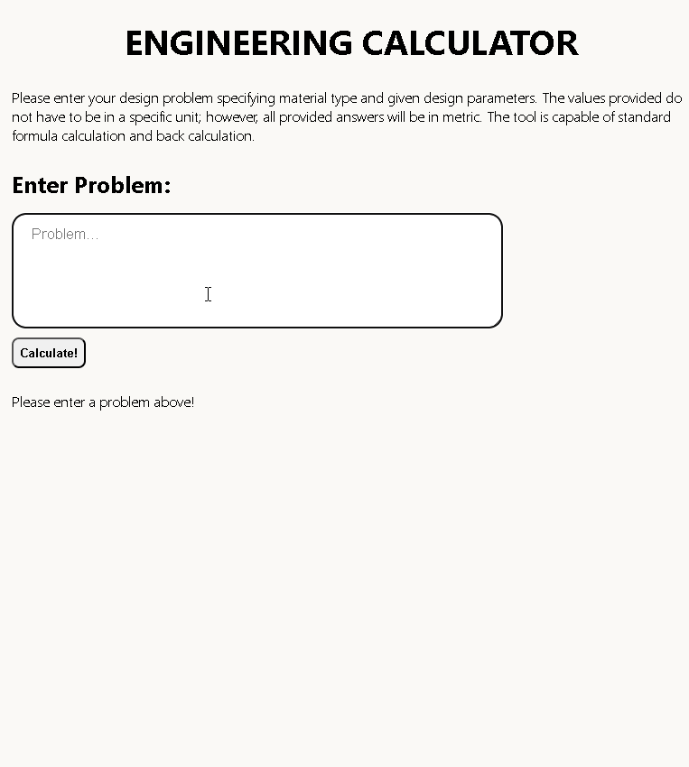

# NLP-Engineering-Solutions

Due to the monotonous nature of referencing material properties and identifying design parameters from external resources for engineering calculations, the development of NLP based calculation tools becomes necessary to stay at cutting edge of efficiency. NLP Engineering Solutions allows users to accurately calculate third or fourth year engineering problems with solution steps using a text-based problem input that only requires numbers and associated units to perform calculations. The app has been rigorously tested with a myriad of design problems with varying parameters, phrasing, notations, and units.

The NLP model is comprised of a custom spaCy NLP pipeline and RegEx to identify design parameters and calculation targets. Based on the determined design parameters, a database in PostgreSQL containing material properties is queried and incorporated into the calculations which are then sent through a Flask API to the front-end dashboard.

Example of app functionality:

Functional test results demo:

